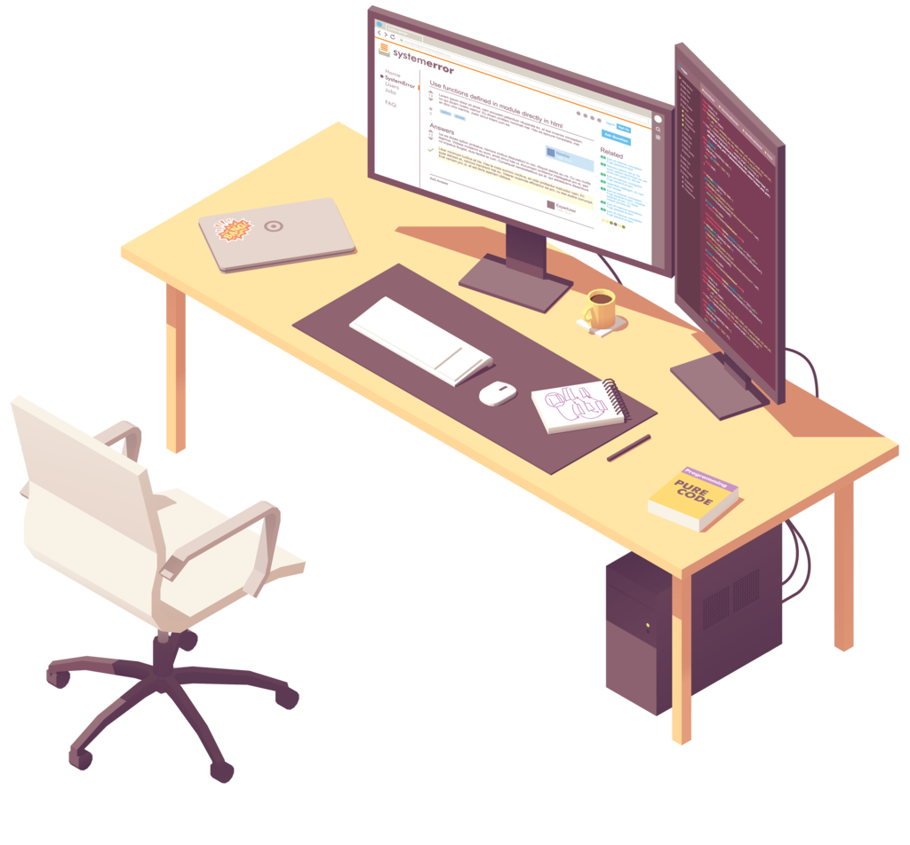

<html>
    <head>
        <meta charset="UTF-8">
        <meta name = 'viewport' content = 'width = device-width, initial-scale = 1.0'>
        <title>Portfolio</title>
        <link rel = 'stylesheet' href = '/assets/css/stylesheet.css'>
        <link rel="stylesheet" href="/assets/css/flickity.css" media="screen">
        <link rel="stylesheet" href="/assets/css/fullscreen.css" media="screen">
    </head>
    <body>
        <section id = 'home'>
            
    <!--class = 'main'-->
                

                    <!--Embed WebGl mini-project here-->
                    <canvas id = 'demoCanvas' width = '1280' height = '720'></canvas>
                    
                    
                

                

                    <h1>Hi, I'm Ewan - A Graphics Programmer</h1>
                    <button class = 'demo' onClick = "window.location.href='#portfolio'">See what I can do </button>
                     
                    
                

            

        </section>
        <section id="portfolio">
            
 
                <h1 class = 'title'>Portfolio</h1>
                

                    
<a href = '#'>Project 1</a>

                    
<a href = '#'>Project 2</a>

                    
<a href = '#'>Project 3</a>

                    
<a href = '#'>Project 4</a>

                
    
                

                    <h2>Projects</h2>
                    <h3 style = 'text-align: center;'>My Development Journey manifests itself in Game Projects, Applications, and Academic Works</h3>
                    

                        <h2>Games</h2>
                        <!---->
                        

                            <ul><a href = '#'><h3>Game 1</h3></a></ul>
                            <ul><a href = '#'><h3>Game 2</h3></a></ul>
                            <ul><a href = '#'><h3>Game 3</h3></a></ul>
                        

                        <h2>Applications</h2>
                        

                            <ul><a href = '#'><h3>Application 1</h3></a></ul>
                            <ul><a href = '#'><h3>Application 2</h3></a></ul>
                            <ul><a href = '#'><h3>Application 3</h3></a></ul>
                        

                        <h2>Academic Work</h2>
                        

                            <ul><a href = '#'><h3>Coursework 1</h3></a></ul>
                            <ul><a href = '#'><h3>Coursework 2</h3></a></ul>
                            <ul><a href = '#'><h3>Coursework 3</h3></a></ul>
                        

                    

                    <a href = '/projects/'>Take a look at my other works</a>
                
            
            

        </section>
        <section id="skills">
       

            <h1 class = 'title'>Skills</h1>
            

                

                    <h2>Programming</h2>
                    

                        <h4>Languages</h4>
                        
C / C++ 

                        
C# 

                        
HLSL / GLSL 
     
                        
x86 Assembly 
    
                        
GO 
                   
                    

                    

                        <h4>Technologies</h4>
                        
DirectX 11 

                        
DirectX 12

                        
Vulkan 
     
                        
CUDA 
    
                        
OpenCV 
      
                        
SQL 
      
                    

                

                

                    <h2>Tools</h2>
                    <ul>
                        <li>Visual Studio</li>
                        <li>Git</li>
                        <li>NVidia NSight</li>
                        <li>Pix Profiler</li>
                        <li>Unreal Engine 4</li>
                        <li>Unity Engine</li>
                        <li>Jira</li> 
                        <li>Adobe Photoshop</li>
                    </ul>
                

                

                    <h2>Strengths</h2>
                    <ul>
                        <li>Low-level Software Optimization</li>
                        <li>Game Engine Architecture</li>
                        <li>Library Development</li>
                        <li>Parallelisation</li>
                        <li>Software Engineering</li>
                        <li>Project Management</li>
                        <li>Augmented Reality Applications</li>
                        <li>Web Development</li>
                    </ul>
                

            

            

            <h2>Timeline</h2>
                    

                        <h3>Confetti Institute of Creative Technologies (2018 - 2020) | Distinction</h3>
                        
Student of Games Technology - covering gameplay programming, teamwork, 3d modelling, industry skills and leadership.

                    

                    

                        <h3>Sheffield Hallam University (2020 - 2025)</h3>
                        
Master's Student in Computer Science for Games.

                    

            

        

       </section>
       <section id = "details">
       

            <h1 class = 'title'>About Me</h1>
            

                        
                    

                        

                            

                                <h2>Ewan Burnett</h2>
                                

                                I am an adept programmer and software developer - mainly rooted in C/C++, but also proficient in C#, HLSL and x86 ASM. I've used this knowledge to learn frameworks like DirectX 11 - which enable me to engineer efficient graphical applications. Though I'm rooted in Game Development, my skills are applicable across the board.
                                

                                
I've been studying Game Development since 2018 - during which I have participated in multiple game jams, tested games for local studios, and worked on personal projects. 

                                

                                Looking forwards, my aspiration is to break into the games industry professionally- focusing on tool and game engine development, and creating development environments for Augmented and Virtual reality platforms. 
                                

                                <a class = 'resumebutton' href = '/Resources/Ewan Burnett CV 2021-2022.pdf' target = "_blank">CV / Resumé</a>
                            

                                

                                    <h3>Email Me</h3>
                                    <a href = 'mailto:ewanburnettsk@outlook.com'>EwanBurnettSK@outlook.com</a>
                                

                                

                                    <h3>Social Media</h3>                            
                                        <a href = 'https://github.com/ewanburnett'>Github</a>
                                        <a href = 'https://www.linkedin.com/in/ewanburnettsk'>Linkedin</a>
                                        <a href = 'https://twitter.com/strikerdev_'>Twitter</a>                            
                                

                            

                        

                    

                

            

        

       </section>
       
       
    </body>
</html>
